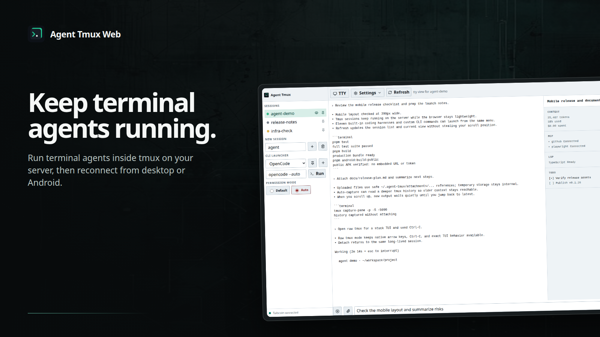
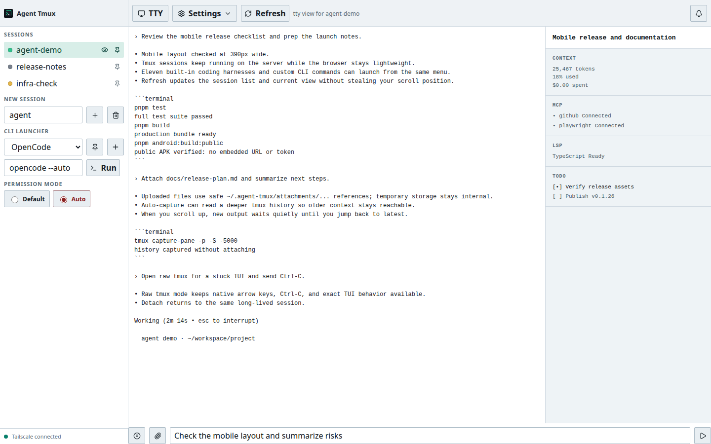
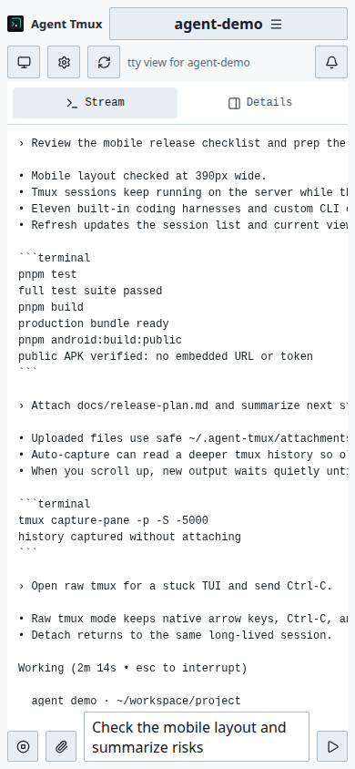
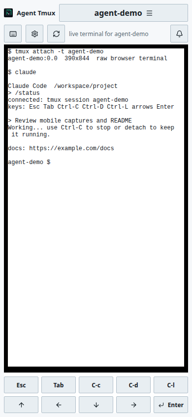
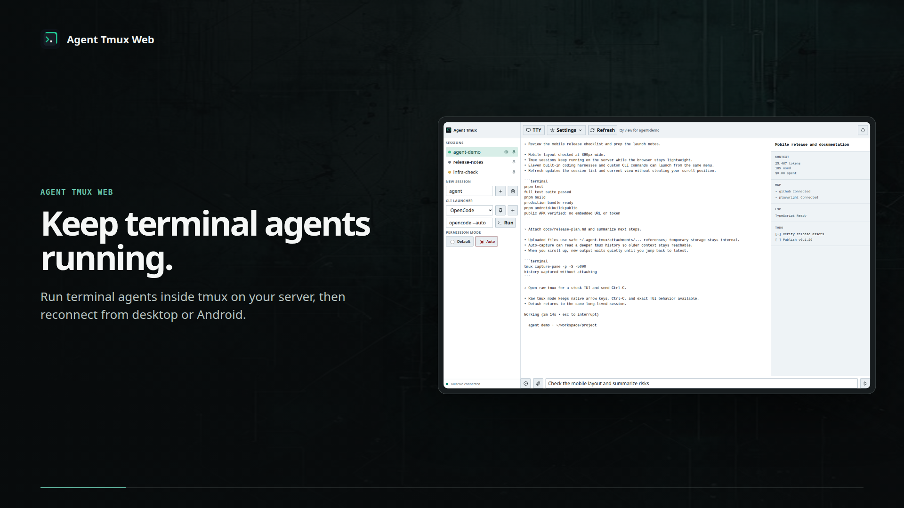

# Agent Tmux Web

<p>
  
</p>

Run long-lived coding-agent CLIs from your phone or desktop while tmux keeps
the real processes alive on your server.

Agent Tmux Web is a private browser control surface for tmux-backed agent
sessions. It is useful when SSH on a phone is too cramped, when mobile browsers
disconnect, or when you want one place to switch between several terminal-agent
tabs without killing the work.

[](./docs/assets/agent-tmux-web-showcase.mp4)

*TTY-first monitoring with exact Raw control available whenever the terminal itself matters.*

## Product Views



<p>
  
  
</p>

### Professional showcase

[](./docs/assets/agent-tmux-web-showcase.mp4)

## What You Get

- Long-running tmux sessions that survive browser disconnects and phone sleep.
- Mobile-friendly session switching, creation, destruction, and launcher
  controls.
- Built-in launchers for OpenCode, Codex, Claude Code, Gemini CLI, GitHub
  Copilot, Cursor Agent, Qwen Code, Cline, Aider, goose, and Amp.
- Alphabetical launcher selection with per-device pins for favorites and a `+`
  control for saving named custom CLI commands.
- Harness-specific Default, Plan, Auto, Auto Edit, Autopilot, and Yolo controls
  with incompatible permission modes kept mutually exclusive.
- TTY mode by default for selectable text and clickable links. OpenCode's conversation
  stream is separated from its details panel, with mobile tabs and a desktop
  side panel.
- Raw mode for direct interactive tmux control, including shell and TUI work.
- Green, amber, red, and gray status dots for running, actionable prompts,
  errors, and idle sessions.
- Stable scrollback while new tmux output continues arriving.
- File uploads and pasted clipboard images from Android, iOS, or desktop
  browsers, including direct Raw terminal paste with safe
  `~/.agent-tmux/attachments/...` prompt references.
- Browser and Android notifications when sessions need input or become idle.
- Light and dark themes.
- Generic public Android APK plus optional private APK builds for your own
  server URL.

## How It Works

```text
phone or desktop browser
        |
        | private HTTP over localhost, SSH tunnel, LAN, VPN, or Tailscale
        v
Agent Tmux Web server
        |
        v
tmux sessions running coding agents, shells, or custom CLIs
```

The web UI does not host an AI service. It sends keys to tmux, captures pane
output, uploads temporary files, and watches for confirmed input-needed and idle
transitions. Your
agent CLIs and credentials stay on your server.

## Requirements

- Linux, macOS, or a Unix-like server with `tmux`
- Node.js 22+
- `pnpm`
- `git`
- At least one terminal agent command, such as `opencode`, `codex`, `claude`,
  `gemini`, `copilot`, `agent`, or your own script
- Optional but recommended for phone use: Tailscale, a VPN, an SSH tunnel, LAN
  access, or an authenticated reverse proxy

## Quick Install

On Linux, inspect the installer:

```bash
curl -fsSL https://raw.githubusercontent.com/antonlobanovskiy/agent-tmux-web/main/scripts/install-linux.sh
```

Run it:

```bash
curl -fsSL https://raw.githubusercontent.com/antonlobanovskiy/agent-tmux-web/main/scripts/install-linux.sh | bash
```

The installer clones or updates the app, installs dependencies, builds the
server, writes a private `.env` with a generated auth token, and starts a
systemd user service when available.

Bind to a private network address when you want phone access:

```bash
HOST=100.x.y.z CLI_WEB_DEFAULT_CWD="$HOME/dev" \
  bash <(curl -fsSL https://raw.githubusercontent.com/antonlobanovskiy/agent-tmux-web/main/scripts/install-linux.sh)
```

Use `HOST=127.0.0.1` for local-only or SSH tunnel access. Use a Tailscale IP,
tailnet DNS name, LAN IP, or private reverse proxy for phone access. Do not bind
this app directly to the public internet.

More install detail: [INSTALL.md](./INSTALL.md)

## Manual Setup

```bash
git clone https://github.com/antonlobanovskiy/agent-tmux-web.git
cd agent-tmux-web
pnpm install
cp .env.example .env
pnpm build
HOST=127.0.0.1 PORT=6174 pnpm start
```

Open `http://127.0.0.1:6174`.

For another device, set `HOST` to a private reachable address and set an auth
token:

```bash
export AGENT_TMUX_WEB_AUTH_TOKEN="$(openssl rand -hex 32)"
HOST=100.x.y.z PORT=6174 pnpm start
```

Open:

```text
http://100.x.y.z:6174/?token=<generated-token>
```

For AI-assisted setup, give your assistant [AI_SETUP.md](./AI_SETUP.md). It is a
checklist for installing privately, verifying tmux, launchers, uploads, raw
mode, and notifications.

## Using The App

1. Pick or create a tmux session from the session list.
2. Choose a launcher, pin favorites to the top, or use `+` to save a named
   custom command on that device.
3. Press `Run`, or type directly into the tmux input.
4. TTY opens by default. Use the view toggle for Raw when exact terminal input
   matters. With session memory enabled, each tmux session returns to its last
   selected view.
5. Open `Settings` to choose the default view, remember each session or always
   return to the default, change the theme, copy the server URL, or update
   Android connection settings.
6. Use the bell button for alerts when a session needs input or becomes idle.
7. Use the paperclip button to upload files, or paste clipboard images into a
   captured-view prompt or directly into Raw with `Ctrl+V`/`Cmd+V`.
   `Ctrl+Shift+V` can recover images when the browser permits async clipboard
   reads. Uploads remain temporary on the server, while prompts receive safe
   `~/.agent-tmux/attachments/...` references readable by local CLIs.
8. In Raw, modified keys pass through tmux like a local terminal. OpenCode can
   distinguish `Shift+Enter` for a newline while browser clipboard shortcuts
   stay on the viewing device.

Status dots:

- Green: the selected tmux pane looks actively running.
- Amber: the visible pane is asking a question or needs permission.
- Red: recent captured output looks like an error.
- Gray: the pane is idle or waiting at its normal prompt.

The terminal output starts directly below the toolbar. Session health remains
visible through the sidebar status dots.

TTY captures up to 5,000 rows of tmux history. Sessions created in the app are
configured with at least that much history; recreate older sessions to raise
their pane limit because tmux cannot restore rows it already discarded.

## Android App

The Android app in [android/](./android) is a native WebView wrapper for your
running Agent Tmux Web server. It does not run tmux or agent CLIs on the phone.

Public builds are generic and open to a setup screen. Enter your own server URL
and optional token on-device:

```bash
pnpm android:build:public
```

The APK is written to:

```text
android/app/build/outputs/apk/release/agent-tmux-web-v<version>-release.apk
```

Generic Android App Bundles (configure an upload key before Play submission):

```bash
pnpm android:build:play
```

Private personal APKs can prefill your server URL/token and use a separate
package id so they install next to the public app:

```bash
pnpm android:build:private
```

Do not email APKs or ZIPs containing APKs; many clients block them. For private
delivery, serve the APK from your Agent Tmux Web server over LAN, VPN, or
Tailscale:

```bash
pnpm android:stage-apk android/app/build/outputs/apk/release/agent-tmux-web-v<version>-release.apk
```

Android details: [android/README.md](./android/README.md)<br>
Play Store checklist: [docs/play-store.md](./docs/play-store.md)

## Configuration

Copy `.env.example` or set variables in your service manager.

Common variables:

- `HOST`: HTTP bind host. Defaults to `127.0.0.1`.
- `PORT`: HTTP port. Defaults to `6174`.
- `CLI_WEB_DEFAULT_CWD`: working directory for new tmux sessions.
- `CLI_WEB_TOOLS`: JSON launcher list.
- `AGENT_TMUX_WEB_AUTH_TOKEN`: optional shared token for browser access.
- `AGENT_TMUX_WEB_JSON_LIMIT`: request body limit for large pasted prompts and
  tmux sends. Defaults to `25mb`.
- `AGENT_TMUX_WEB_UPLOAD_DIR`: upload directory. Defaults to
  `/tmp/agent-tmux-web/uploads`. This internal path is not sent to clients.
- `AGENT_TMUX_WEB_UPLOAD_TTL_MS`: upload and safe-reference expiry. Defaults to
  24 hours.
- `CODEX_APP_SERVER_PORT`: optional Codex app-server port.
- `CODEX_APP_SERVER_AUTOSTART`: set to `1` to start Codex app-server on boot.

Built-in launcher modes:

| Harness | Command | Launch modes |
| --- | --- | --- |
| OpenCode | `opencode` | Default, Auto (default) |
| Codex | `codex` | Default, Auto, Yolo |
| Claude Code | `claude` | Default, Plan, Accept edits, Auto, Yolo |
| Gemini CLI | `gemini` | Default, Plan, Auto edit, Yolo |
| GitHub Copilot | `copilot` | Default, Auto tools, Yolo; optional Autopilot toggle |
| Cursor Agent | `agent` | Default, Auto commands |
| Qwen Code | `qwen` | Default, Plan, Auto edit, Auto, Yolo |
| Cline | `cline --tui` | Auto (default), Ask |
| Aider | `aider` | Default, Always yes |
| goose | `goose session` | Harness defaults |
| Amp | `amp` | Harness defaults |

High-risk modes are marked in red. They can execute tools without individual
approval and should be used only in trusted repositories or an external
sandbox. Amp is autonomous by default, and Cline CLI defaults to auto approval;
consult those harnesses' own security controls before launching them on an
untrusted host.

`CLI_WEB_TOOLS` replaces the complete built-in catalog. Each mode appends its
`args` to the base command. Give mutually exclusive choices the same
`exclusiveGroup`; ungrouped modes remain independent checkboxes. `description`
becomes hover help, and `dangerous` adds the high-risk treatment.

Example custom launcher config:

```json
[
  {
    "id": "claude",
    "label": "Claude Code",
    "command": "claude",
    "defaultSessionName": "claude",
    "modes": [
      {
        "id": "default",
        "label": "Default",
        "args": "",
        "defaultEnabled": true,
        "exclusiveGroup": "permissions"
      },
      {
        "id": "yolo",
        "label": "Yolo",
        "args": "--dangerously-skip-permissions",
        "exclusiveGroup": "permissions",
        "description": "Bypass all permission checks.",
        "dangerous": true
      }
    ]
  }
]
```

Use `Custom` in the UI for one-off commands such as:

```bash
codex -C /workspace/project -m gpt-5.5
```

## systemd

`ops/systemd/agent-tmux-web.service` is an example user service. Before
installing it, edit `WorkingDirectory`, `HOST`, `PORT`, and any environment
values for your machine.

```bash
mkdir -p ~/.config/systemd/user
cp ops/systemd/agent-tmux-web.service ~/.config/systemd/user/agent-tmux-web.service
systemctl --user daemon-reload
systemctl --user enable --now agent-tmux-web.service
```

Check it:

```bash
systemctl --user status agent-tmux-web.service --no-pager
journalctl --user -u agent-tmux-web.service -n 100 --no-pager
```

## Source Registry

This repo ships a shadcn-compatible GitHub source registry for discovery,
inspection, dry runs, and agent-assisted source adaptation:

```bash
pnpm dlx shadcn@latest list antonlobanovskiy/agent-tmux-web
pnpm dlx shadcn@latest search antonlobanovskiy/agent-tmux-web --query tmux
pnpm dlx shadcn@latest view antonlobanovskiy/agent-tmux-web/full-project
pnpm dlx shadcn@latest add antonlobanovskiy/agent-tmux-web/full-project --dry-run
```

Registry items:

- `full-project`
- `web-app`
- `vps-deploy`
- `android-wrapper`
- `notifications`

The registry is source-oriented and intentionally omits binary media assets,
launcher images, and the Gradle wrapper jar. Clone the repository when you need
the complete asset set.

Registry details: [docs/registry.md](./docs/registry.md)

## Development

```bash
pnpm install
pnpm test
pnpm typecheck
pnpm build
```

Run locally:

```bash
HOST=127.0.0.1 PORT=6174 pnpm start
```

Open demo mode without touching real tmux sessions:

```text
http://127.0.0.1:6174/?demo=1
```

Generate local marketing media for review:

```bash
pnpm build
pnpm capture:marketing
```

The opt-in capture script regenerates the reviewed public inventory under
`docs/assets/` from loopback demo mode using Playwright Chromium and `ffmpeg`.
If Chromium is missing on a fresh machine, run
`pnpm exec playwright install chromium`. Treat regenerated output as candidates:
visually inspect it, scan metadata, and complete a privacy and copy review before
commit. Image generation is limited to the non-product backdrop.

Marketing copy guidance is in [docs/marketing.md](./docs/marketing.md).

## Versioning And Releases

Agent Tmux Web is open source. Public versions are tracked in `package.json` and
`android/app/build.gradle`; APK filenames include the version:

```text
agent-tmux-web-v<version>-release.apk
```

Public releases must stay generic. Do not commit private server URLs, auth
tokens, `.env` files, staged APKs, uploads, generated logs, machine-specific
service files, or private signing material.

Release notes: [CHANGELOG.md](./CHANGELOG.md)

## Security Notes

- Treat access to this UI as terminal access to the server user running it.
- Do not expose it directly to the public internet.
- Use localhost, SSH tunnel, LAN, VPN, Tailscale, or an authenticated reverse
  proxy.
- Set `AGENT_TMUX_WEB_AUTH_TOKEN` when anyone else can reach the bind address.
- Uploads are temporary by default and are cleaned on startup and hourly.
- Public Android builds must be created with `pnpm android:build:public` or
  `pnpm android:build:play` so no private URL/token is embedded.

Publishing or cloning this repository does not expose the maintainer's running
server, tmux sessions, uploads, `.env`, auth token, or local systemd service.

## License

MIT
