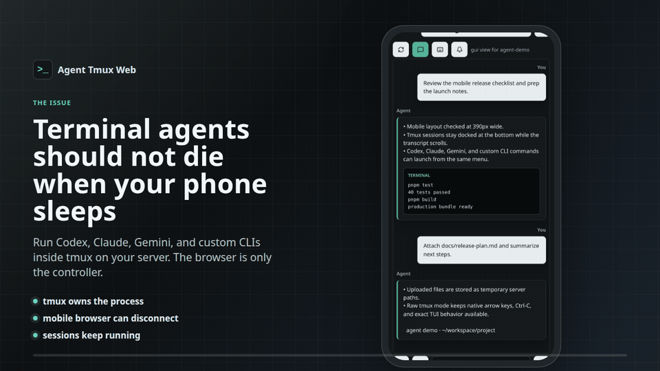
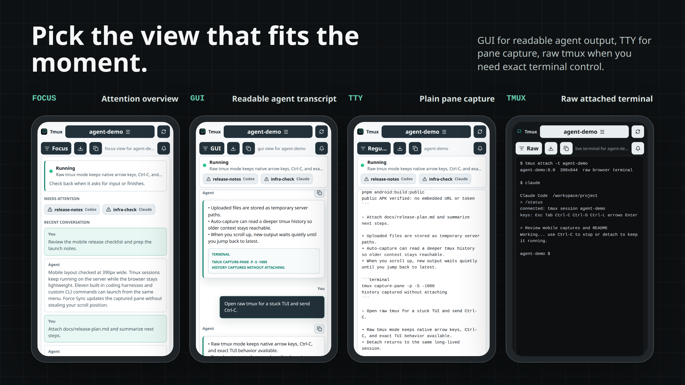

# Agent Tmux Web

Run long-lived Codex, Claude, Gemini, and custom terminal agents from your phone
without keeping an SSH client open.

Terminal agents are powerful, but they are awkward on mobile: SSH sessions resize
panes, disconnects break the flow, file upload is clumsy, and switching between
multiple agent sessions takes too much ceremony. Agent Tmux Web keeps the real
work inside tmux on your server and gives your phone or desktop a focused browser
control surface.

Use the normalized chat view when you want readable CLI output. Attach to raw
tmux when you need exact terminal behavior, arrow keys, Ctrl-C, or a full TUI.
The session keeps running either way.

## Demo



[MP4 showcase](./docs/assets/agent-tmux-web-showcase.mp4)

## What It Solves

- Keeps terminal agents alive on the server even if your browser disconnects.
- Makes active tmux sessions visible and switchable from mobile.
- Launches Codex, Claude, Gemini, or custom commands in the selected
  tmux session.
- Gives you both a readable chat-style transcript and raw tmux attach mode.
- Uploads files from Android, iOS, or desktop browsers to temporary server paths
  you can paste into prompts.
- Works over Tailscale, a VPN, an SSH tunnel, a LAN bind, or a private reverse
  proxy.

## Modes



## Android App

The repo includes a native Android wrapper in [`android/`](./android). It loads
your running Agent Tmux Web server in a WebView, stores the server URL/token on
the device, supports Android file picking for uploads, and uses a native bridge
for task-done notifications.

```bash
pnpm android:build
```

For setup details, see [`android/README.md`](./android/README.md).

## Features

- Lists tmux sessions and switches between them.
- Creates and destroys tmux sessions.
- Launches configured CLI tools inside the selected tmux session.
- Ships with default launchers for Codex and Claude.
- Supports custom launch commands from the UI.
- Supports optional per-tool mode toggles for flags such as Codex Yolo mode.
- Captures tmux panes as either terminal text or a normalized chat-style view.
- Attaches a raw browser terminal to tmux for exact native CLI behavior.
- Can send browser notifications when the selected tmux session returns to an
  input prompt after a send/run action.
- Uploads files from Android/desktop browsers to a temporary server path and
  inserts that path into the prompt.
- Optionally starts the Codex app-server for Codex-specific thread/model/skill
  APIs. The tmux workflow works without it.

## Requirements

- Node.js 22+
- pnpm
- tmux
- A CLI tool to run in tmux, such as `codex`, `claude`, `gemini`, or a shell
  script
- Optional: Tailscale or another private network path to the server

## Setup

For AI-assisted setup, point your assistant at [AI_SETUP.md](./AI_SETUP.md) and
ask it to install Agent Tmux Web on your server. That file is written as a
step-by-step checklist for getting the app running privately and verifying tmux,
launchers, raw mode, uploads, and notifications.

```bash
git clone <your-agent-tmux-web-repo-url>
cd agent-tmux-web
pnpm install
cp .env.example .env
pnpm build
HOST=127.0.0.1 PORT=6174 pnpm start
```

Open `http://127.0.0.1:6174` in a browser on the same machine.

For phone access, bind `HOST` to a private interface and use a private network
path:

- `127.0.0.1` for local-only or SSH tunnel use.
- A Tailscale IP such as `100.x.y.z` for tailnet-only access.
- `0.0.0.0` only behind a firewall, VPN, or authenticated reverse proxy.

When anyone else can reach the bind address, set `AGENT_TMUX_WEB_AUTH_TOKEN` and
open the app with `?token=...`. Use a generated token, not the placeholder below:

```bash
export AGENT_TMUX_WEB_AUTH_TOKEN="$(openssl rand -hex 32)"
HOST=100.x.y.z PORT=6174 pnpm start
```

Then open:

```text
http://100.x.y.z:6174/?token=<the generated token>
```

## Configuration

Copy `.env.example` or set environment variables in your service manager.

Useful variables:

- `HOST`: HTTP bind host. Defaults to `127.0.0.1`.
- `PORT`: HTTP port. Defaults to `6174`.
- `CLI_WEB_DEFAULT_CWD`: working directory used for new tmux sessions.
- `CLI_WEB_TOOLS`: JSON array of launchers shown in the tmux menu. Each
  launcher can define optional `modes`; each enabled mode appends its `args` to
  the base command.
- `AGENT_TMUX_WEB_AUTH_TOKEN`: optional shared token for browser access.
- `AGENT_TMUX_WEB_UPLOAD_DIR`: optional upload directory. Defaults to
  `/tmp/agent-tmux-web/uploads`.
- `AGENT_TMUX_WEB_UPLOAD_TTL_MS`: upload expiry. Defaults to 24 hours.
- `CODEX_APP_SERVER_PORT`: optional Codex app-server port.
- `CODEX_APP_SERVER_AUTOSTART`: set to `1` to start Codex app-server on boot.

Example `CLI_WEB_TOOLS`:

```json
[
  {
    "id": "codex",
    "label": "Codex",
    "command": "codex",
    "defaultSessionName": "codex",
    "modes": [{ "id": "yolo", "label": "Yolo", "args": "--yolo" }]
  },
  { "id": "claude", "label": "Claude", "command": "claude", "defaultSessionName": "claude" },
  { "id": "gemini", "label": "Gemini", "command": "gemini", "defaultSessionName": "gemini" }
]
```

For flags that do not deserve a reusable toggle, select `Custom` in the tmux
menu and enter the full command, for example:

```bash
codex -C /workspace/project -m gpt-5.5
```

Use the bell button in the tmux toolbar to enable browser notifications. After
permission is granted, the app watches send/run actions in the selected tmux
session and notifies when the captured pane looks ready for input again. While a
watched task is active, capture polling can continue even if the browser tab is
hidden.

Mobile browsers usually require a secure browser context for notifications. Use
HTTPS, localhost, or an installed/private browser context that your browser
treats as secure.

## systemd

`ops/systemd/agent-tmux-web.service` is an example user service. Before installing
it, change `WorkingDirectory`, `HOST`, and any environment values for your
machine.

```bash
mkdir -p ~/.config/systemd/user
cp ops/systemd/agent-tmux-web.service ~/.config/systemd/user/agent-tmux-web.service
systemctl --user daemon-reload
systemctl --user enable --now agent-tmux-web.service
```

## Security Notes

- This repository is just the application code. Publishing or cloning it does
  not expose anyone's running server, tmux sessions, uploads, `.env`, auth token,
  or local systemd service.
- Do not expose this app directly to the public internet.
- Treat browser access as terminal access to the server user running the app.
- Use a VPN, SSH tunnel, or authenticated reverse proxy.
- Set `AGENT_TMUX_WEB_AUTH_TOKEN` if the app can be reached by anyone else.
- Uploads are temporary by default and are cleaned on startup and hourly.
- Keep each deployment separate from the repo: do not commit local `.env` files,
  uploads, build output, generated logs, or service files with real IPs,
  usernames, tokens, or private paths.

## License

MIT
